Functional Flows:
-----------------
Onboard Theatre:

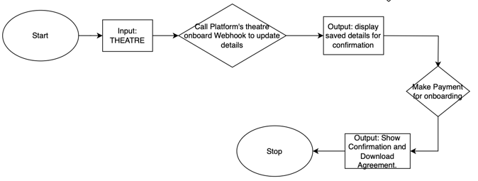

Onboard Show:

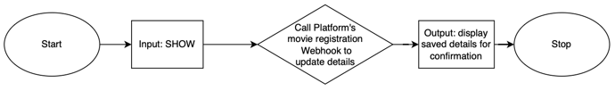

Ticket Booking :

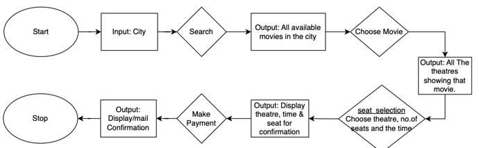

Data Model
----------
1) Relational:

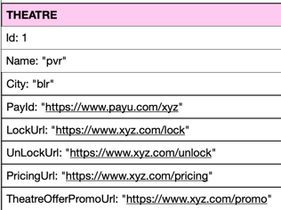  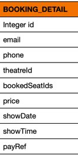  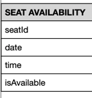

2) No Sql:

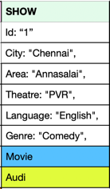  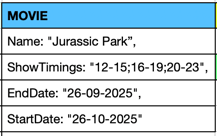  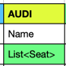  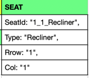
			

Logical Architecture
---------------------
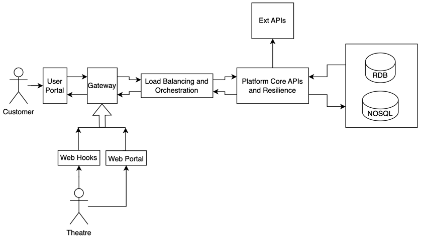

Reference Architecture
----------------------
1) The following is the basic reference architecture that has been used to come up with the System Architecture of the given problem statement.

-Reference: https://learn.microsoft.com/en-us/azure/architecture/microservices/design/patterns

2) The following is the generic reference architecture that will be used to design the internal
components wherever applicable

Overall Deployment Architecture
--------------------------------
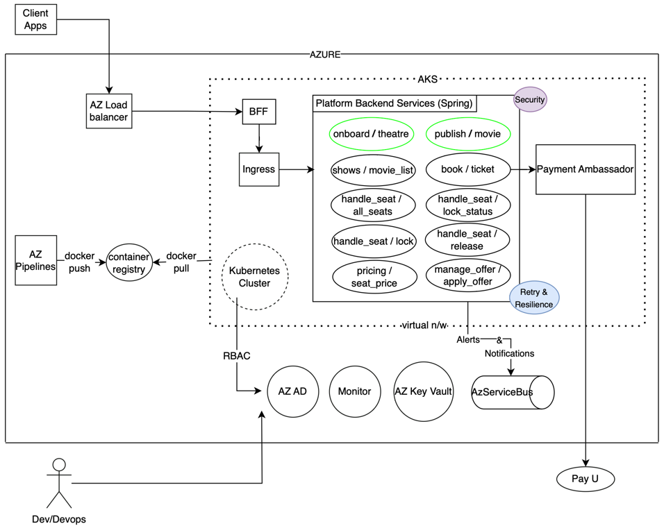

Disaster Recovery Architecture:
-------------------------------
Normal
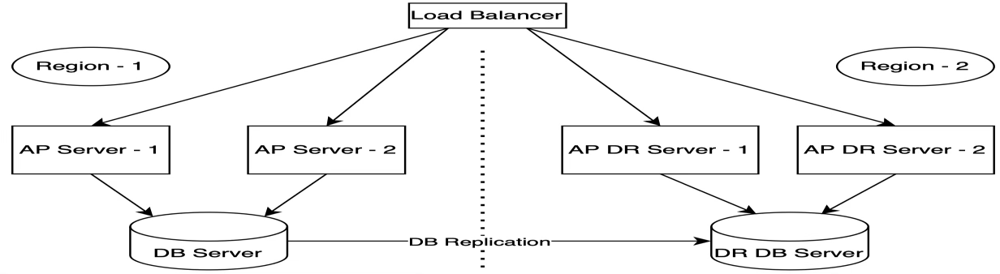

App Server Down:
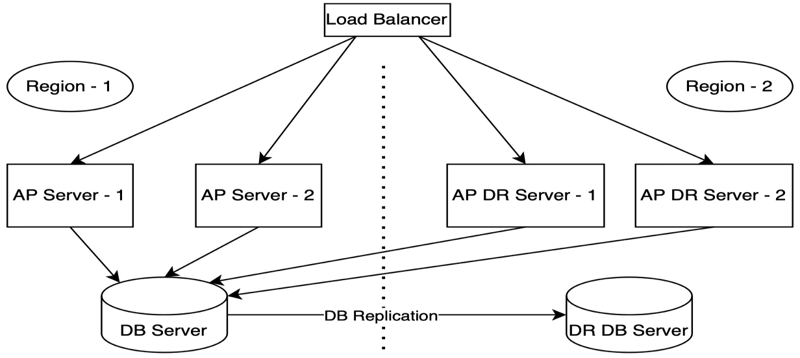

DB Server Down:
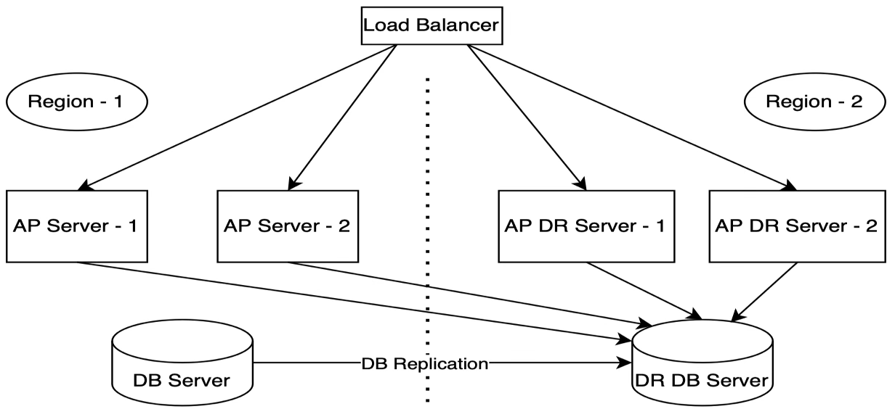

