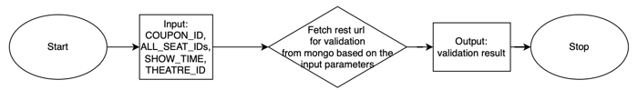
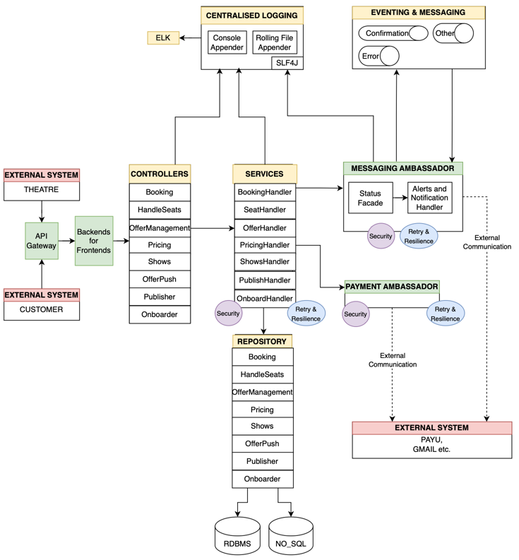

**Assumptions:**
------------
------------
* Architecture Framework used: TOGAF
* Architecture Vision has been developed
* Stakeholders have been Identified.
* Statement of Architecture Work has been created, and business context is validated.
* Architecture Principles and business principles are confirmed and elaborated
* TOGAF library including standard terminology, reusable components etc. are in place
* This architecture work to be done in a itearative manner which includes monitor baseline requirements and Identify changed requirement; remove, add, modify, and re-assess priorities

**Major Functional Flows:**
-----------------
-----------------
* Onboard Theatre:

* Onboard Show:

* Ticket Booking:

* Offer Management (Validation):

* Offer Management (Apply Coupon):

* Seat Locking: <<-To Be Done->>
* Seat Releasing: <<-To Be Done->>
* Ticket Cancellation: <<-To Be Done->>

**Data Model**
----------
----------
* Relational:

    

* No-Sql:

    

    

**Major Data Flow**
---------------------
---------------------
* Theatre Onboarding

* Movie Publishing

* Ticket Booking

**Major API Specifications**
----------------------
----------------------
* Major APIs:-
  * Theatre Onboarding:
    * @PostMapping(value = "/theatre")
      public ResponseEntity<TheatreDto> theatre(@RequestBody TheatreDto theatreDto)
  * Movie Publishing:
    * @PostMapping(value = "/movie")
      public ResponseEntity<List<Show>> publishMovie(@RequestBody Shows theatreShows)
  * Ticket Booking:
    * @PostMapping(value = "/ticket")
      public ResponseEntity<BookingDetail> movie(@RequestBody BookingDetail booking)
  * Get All Seats for display:
    * @GetMapping(value = "/all_seats")
      public ResponseEntity<Map<String, String>> allSeats(@RequestParam String theatre, @RequestParam String audi, @RequestParam String show)

* Other APIs:-
  * Lock Status:
    * @GetMapping(value = "/lock_status")
      public ResponseEntity<Map<String, String>> lockStatus(@RequestParam String theatre, @RequestParam String audi, @RequestParam String show)
  * Lock Seat:
    * @PostMapping(value = "/lock")
      public ResponseEntity<Boolean> reserveSeat(@RequestParam String theatre, @RequestParam String seatId, @RequestParam String showDate, @RequestParam String showTime)
  * Seat Releasing:
    * @GetMapping(value = "/release")
      public ResponseEntity<Boolean> releaseSeat(@RequestParam String theatre, @RequestParam String seat, @RequestParam String showTime)
  * Offer Management:
    * @GetMapping(value = "/validate_coupon")
      public ResponseEntity<String> validateCoupon(@RequestParam Integer theatreId, @RequestParam List<String> seatIds, @RequestParam String showTime, @RequestParam String coupon)
    * @GetMapping(value = "/apply_offer")
      public ResponseEntity<Double> calculateOffer(@RequestParam Integer theatreId, @RequestParam List<String> seatIds, @RequestParam String showTime, @RequestParam String coupon, @RequestParam Double price)
  * Ticket Cancellation: <<-To Be Done->>
  * Scheduled Batch Processing for daily DB clean-ups after all shows are over: <<-To Be Done->>

**Database Design**
--------------------------
--------------------------
* RDBMS (H2) for THEATRE, BOOKING_DETAILS and SEAT_AVAILABILITY data:
  * This data to be persisted is expected to be well-structured.
  * Booking Detail table is expected to have multiple inserts/updates. 
* NOSQL (Mongo-DB) for SHOWS data:
  * This data will involve heavy querying and select statements.
  * This data is also not expected to be updated frequently after it is published.
  * It can be erased after the show period is completed and withdrawn by the theatre.

**Architectural Overview**
--------------------------
--------------------------
Technology Stack
----------------
* Architecture: [Microservices [CQRS/SAGA], Facade, Adapter etc.]
* Resilience: [Hystrix, Retry etc.]
* Build and Orchestration: [Docker, K8S, Cloud Pipelines (eg. Azure Pipeline)]
* Cloud [Azure or AWS]
* Java 21, Spring [Boot, REST, Kafka, Data-JPA]
* Implementing ADHOC offers issued by Theatre and Platform using Azure Functions / AWS Lambda
* Java 8+, Spring [Boot, REST, Kafka, Data-JPA]
* Eventing and Messaging: [Kafka Topics]
* Datastore: RDBMS, NOSQL
* Monitoring: [ELK/Splunk etc.]

Logical Architecture
---------------------

Reference Architecture
----------------------
* The following is the basic reference architecture that has been used to come up with the System Architecture of the given problem statement.
 [Reference: https://learn.microsoft.com/en-us/azure/architecture/microservices/design/patterns]

* The following is the generic reference architecture that will be used to design the internal
components wherever applicable

Detailed System Architecture
------------------------------

Overall Build and Deployment Architecture
--------------------------------

Disaster Recovery Architecture:
-------------------------------
Normal

App Server Down:

DB Server Down:

**Key NFR Overview**
----------------
----------------
* **Scalability:** Horizontal Scaling looks to be a feasible solution for scalability. Auto-scaling feature of the
cloud provider like AKS etc. to generate or purge API instances based on demand.
* **Availability:** A highly scalable system is highly available. When a node or instance is down, the requests
will automatically be routed to the next available instance or node. This facility will be configured with
Kubernetes and Cloud Provider. We may plan to use caching for e.g. REDIS; for the GET APIs so to avoid database round trips.
* **Performance:** Try to go for a Reactive approach to promote non-blocking calls and making the system more concurrent.
* **Durability and Resilience:** Task execution to be tracked and degraded gracefully by appropriate
monitoring and retrying with appropriate state. Retry to happen with help of Hystrix and there would be a
fallback after all retry options are exhausted.
* **Bounded wait Time:** Monitor the performance of the task execution and notify when any task takes
longer time to execute. Based on notification further actions including closing the execution etc. will be
made. The monitoring can be done using tools like App Dynamics or Controller_Advices etc.
* **Extensibility, Agility & Usability:** Follow 12-Factor-Application principles Aiming to make application easy to configure, deploy, extend and enhance by making it loosely coupled
* **Observation and Logging:** Perform secure application logging to monitor issues. Use Monitoring tools like ELK, Cloud tools etc. Also use performance monitoring tools like APM, AppDynamics etc to monitor performance at runtime.

High Level Availability Details
-------------------------------
  * Cloud provided K8S services will be responsible for routing to the next available instance based on Auto-Scaling configuration.
  * Resilience to be handled by Hystrix and Retry.
  * Retry for a bounded time.
  * Fallback after retry exhausted.
  * Long-running tasks to be monitored and purged after the cut-off time. This to be retried at any later schedule.

High Level Scaling Details
---------------------------
  * Cloud manages all API Instance Availability.
  * Cloud manages the availability of topics.
  * Making use of Cloud Auto Scaling facilities.
  * The load will not be high all the time.
  * When the load increases on occasional times, the Autoscaling facility of the cloud will automatically provision new instances of scheduler based on the auto-scaling configuration.
  * When the load decreases, the unused instances will be purged.

High Level Security Details
-------------------------------
  * Follow OWASP-10 principles including the below.
  * Use JSYPT to encrypt the Passwords in property files.
  * Use encryption or decryption wherever applicable.
  * Use Key Vault or wallets like Oracle Wallets to securely store passwords.
  * Use OAuth to secure Service to Service communications.
  * Use 2-Factor Authentication whenever interacting with Customers including Theatres or Ticket buyers.

High level Storage Details
--------------------------
  * Storage for CICD build and deploy.
  * Storage for Database, Messaging Infrastructure
  * Storage for Running APIs
  * Storage for Application Logs

Approximate Storage Estimations
-------------------------------
* Approximate Request Load
 
| API              | Size of 1 Request |
|------------------|-------------------|
| Theatre Onboard  | 4 - 8 kb          |
| Movie Publish    | 20 - 30 kb        |
| Offer Push       | 4 - 8 kb          |
| Booking          | 10 - 15 kb        |
| Handle Seat      | 4 - 5 kb          |
| Offer Management | 4 - 5 kb          |
| Pricing          | 4 - 5 kb          |
| Shows            | 60 - 80 kb        |

* Approximate Runtime Load
  * Each Platform (Spring Boot) instance: 200-300 mb
  * Each Flow at runtime average: 20 - 25 kb
  * Average Size of each row in a table: 20 - 25 kb
  * Expected number of concurrent booking request received at peak time: 1 lac
  * Expected number of instances of Platform APIs required to be available at peak time: 800 to 1000.

--------------------------------------------------------------------------------------------------------------------------------------------
